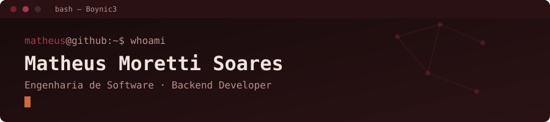

<!-- PARTE 1: BANNER BASH PERSONALIZADO DO MATHEUS -->

  

<!-- PARTE 2: SOBRE MIM (Imagem à esquerda, texto à direita) -->

  <!-- O align="left" aqui é o que faz a mágica acontecer -->
  
  
  <h2>ㅤㅤㅤㅤㅤㅤㅤㅤㅤㅤㅤㅤㅤㅤ­Sobre Mim</h2>
  
ㅤㅤ    Sou estudante de <b>Engenharia de Software na UnB (FGA)</b>, focado em projetar a arquitetura lógica de ㅤㅤsistemas complexos. Minha base em engenharia é usada para desenhar a espinha dorsal do backend, ㅤㅤpriorizando arquitetura limpa e performance.
  

  

    ㅤㅤ🚀 <b>Ecossistema Principal:</b> Java e Python. 
    ㅤㅤ👨‍💻 <b>Estudando no momento:</b> Algoritmos e Grafos, Desenvolvimento Web e Teoria dos Números paraㅤㅤㅤㅤ Computação. 
    ㅤㅤ⚙️ <b>Entusiasta:</b> DevOps, QA, conteinerização e automação, Redes Neurais e Inteligência Artificial.
  

<!-- IMPORTANTE: Essa tag impede que os elementos de baixo subam e fiquem ao lado da imagem -->
 

<!-- PARTE 3: ARSENAL TÉCNICO (Skillicons integrados ao tema dark) -->
<h3 align="center">🛠️ Meu Arsenal Técnico</h3>

  

 

<h3 align="center">📈 Estatísticas</h3>

  
  

<!-- PARTE 4: PROJETOS EM DESTAQUE -->
<h3 align="center">🚀 Projetos em Destaque</h3>

<!-- PROJETO 1: RIDESHARING -->
#### 🚗 Sistema de Ridesharing
*Backend em Java (POO) focado em gerenciamento de corridas, regras de negócio complexas e arquitetura limpa.*
> `<stack: Java | POO | Clean Architecture>`
> [**Acessar Repositório**](https://github.com/Boynic3/RideSharingProject)

<!-- PROJETO 2: ALGORITMICA -->
#### 🧠 Algoritmica
*Implementações e estudos aprofundados sobre estruturas de dados, algoritmos e teoria dos grafos.*
> `<stack: Algoritmos | Grafos | Estruturas de Dados>`
> [**Acessar Repositório**](https://github.com/Boynic3/Algoritmica)

<!-- PROJETO 3: E-COMMERCE -->
#### 🛒 E-commerce com Chatbot
*Protótipo funcional integrado a um chatbot de atendimento automatizado, construído com Node.js.*
> `<stack: Node.js | Big Data | Chatbot>`
> [**Acessar Repositório**](https://github.com/Boynic3/Chatbot-Ecommerce-Nodejs-BigData)

 

<!-- PARTE 5: LINKS DE CONTATO -->
<h3 align="center">📫 Links de contato</h3>

  
  

